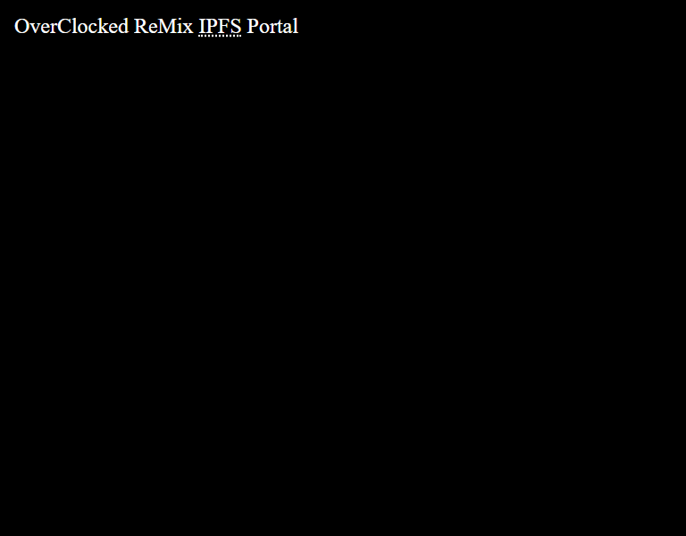

# Proof of concept for browsing & streaming OC ReMix albums via IPFS.

## Build
1) `npm install`
2) `gulp`

## Serve
emojis are used for icons, so serving as utf-8 is required.

### Apache
```
AddDefaultCharset utf-8
```

## Browse
Use any http server of your choice, serve the `./dist/` folder then open in a recent/modern browser.




## Optional Steps
* Install [IPFS companion](https://github.com/ipfs-shipyard/ipfs-companion) (
	this would allow you to fetch content from your local IPFS node,
	rater than using the IPFS API)

# See Also

* [OC ReMix IPFS Data](https://github.com/signpostmarv/ocremix-ipfs-data)
